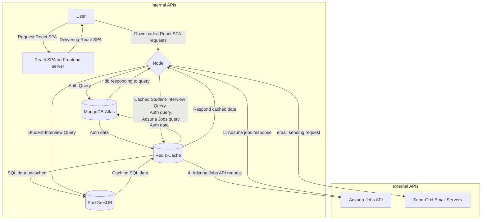
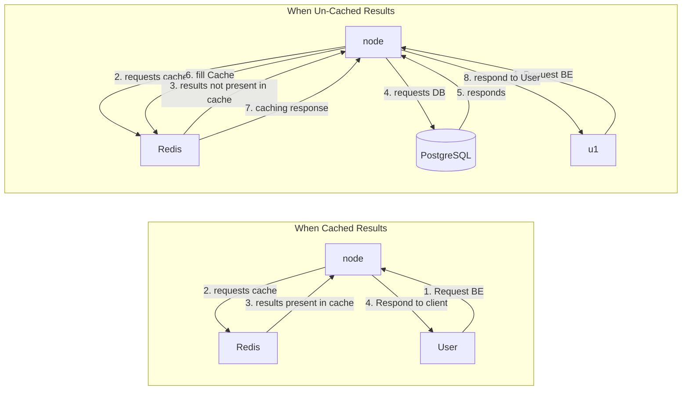
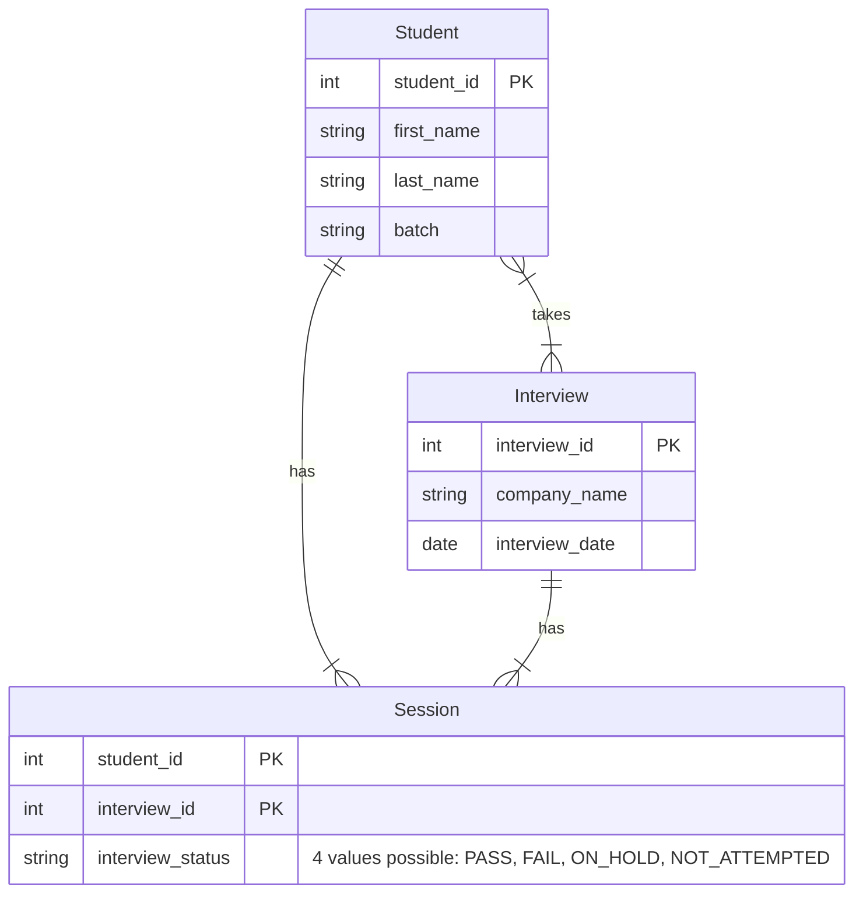

# **Placement-Cell**

_Interview management app for a fictitious coding bootcamp._

Developed for CodingNinja's FullStack MERN project.

Backend hosted at: https://placement-cell-be.onrender.com
Frontend hosted at: https://fe-aauth-node-react.onrender.com/

### **Frontend Walkthrough:** 

Video Walkthorugh of UX:
[](https://youtu.be/hXLodKNI_GY)

---
### **Features:** 
- Typescript for better type safety.
- Reuses auth code from [this repo](https://github.com/piyush-mishra-pm/auth-node-react). Borrows following features:
  - Login/Register via Email, Password.
  - **Google oAuth2** sign-in / register (using Passport)
  - **3 Tier architecture** for better performance.
    - Node/Express backend server.
    - React frontend server.
    - Cloud Mongo DB instance.
  - MVC Design pattern. View layer is react here.
  - Configurable Mail Service to use **Send-grid** for sending emails in production and **MailHog** (SMTP emulator) in Dev mode.
  - Additional auth use cases included:
    - Forgot and Reset password:
      - If forgot password, then password reset token send to email.
      - Password reset token has 1 minute Time To Live.
      - If successfully visited Password recovery token link in email within 1 minute, the password reset can be performed.
    - **Google Re-Captha v2** on Auth and Sign-In pages.
    - Stateless backend using JWT token. No Session Cookies used stored in backend here. HTTP only cookies store JWT token.
- Create and edit Students, Interviews, and manage student-interview outcomes.
- Customisable exports CSV of previewed data.
- Multiple DBs used:
  - MongoDB stores Auth Service data.
  - PostgreSQL stores Student and Interview data.
  - Redis for Caching.

- Folder structure:
  - Cleanly separated in backend and frontend folders, so that deployment on separate frontend and backend servers possible.

- React side:
  - Redux state management, which can be scaled for more demanding apps.
  - Clean and maintanable frontend code.
  - Reusable componensts like Modal, Error, etc.
  - reusable hooks (for http request).

**Tech Stack**: *React-JS, Node-JS, MongoDB, PostgreSQL, Redis*

---
### **Architecture and broad flow:**:

---
### **Caching: Request flow between Node, Redis and PostgreSQL:**:

---
### ***ER Diagram and Attributes***


---

## **How to Run**:
Prerequisites: 
- needs atleast Node v.16.5, and MongoDB pre-installed.
- Prepare env variables file with following variables.
```
```

To run the backend node server on port 8000, in development mode, type following in the command line (assuming your current working directory is this repo).
```
cd ./backend/
npm install
npm run dev
```

To run the frontend ReactJS server on port 3000 type following in the command line (assuming your current working directory is this repo).

```
cd ./frontend/
npm install
npm start
```
---
## **Folder Structure**:
```

```
---
## **Tasks**:
- ✅ Auth service.
- ✅ Redis Caching (Write Through Caching).
- ✅ Students List Page:
  - ✅ CRUD Student.
- ✅ Interviews List Page:
  - ✅ Create Interviews.
  - ✅ Create Assign Students to interview.
  - ✅ Mark Interview results.
- ✅ External Jobs List. (Cached).
- ✅ Download CSV dump:
  - ❌ Allow configuring the data fields required.
  - ❌ Generate paginated preview and give stats of total results.
  - ❌ Allow downloading of final CSV.
- ❌ Update ReadMe.
- ✅ Postgres, routes and controllers for students, interviews and their sessions.
- ✅ DB Cursors (For lists output in get requests).
- ✅ Transactions when student or interviews get deleted, so that sessions also get removed.
- ❌ Validation for path params, body.
- ✅ Redis caching in Get (Student, Interviews and Sessions).
- ❌ Redis caching in Auth.
- ✅ Redis caching in create, update and delete as well. (Cache Invalidation issue.)
- ❌ Modal when fetching list of Students, Interviews, Jobs, etc.