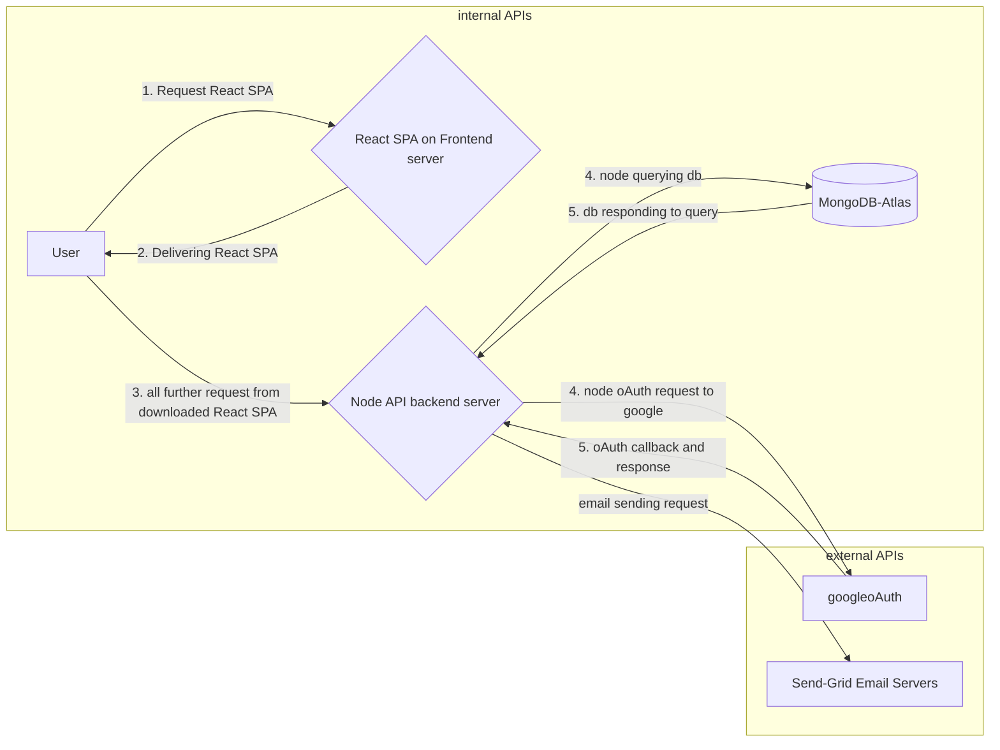

# **Auth-Node-React**

_A reusable starter kit of node react JWT based authentication._

Backend hosted at: https://auth-node-react.onrender.com
Frontend hosted at: https://fe-aauth-node-react.onrender.com/

### **Frontend Walkthrough:** 

Video Walkthorugh of UX:
[](https://youtu.be/hXLodKNI_GY)

### **Architecture and broad flow:**:


---
### **Features:** 
- Typescript for better type safety.
- Login/Register via Email, Password.
- **Google oAuth2** sign-in / register (using Passport)
- **3 Tier architecture** for better performance.
  - Node/Express backend server.
  - React frontend server.
  - Cloud Mongo DB instance.
- MVC Design pattern. View layer is react here.
- Configurable Mail Service to use **Send-grid** for sending emails in production and **MailHog** (SMTP emulator) in Dev mode.
- Additional auth use cases included:
  - Forgot and Reset password:
    - If forgot password, then password reset token send to email.
    - Password reset token has 1 minute Time To Live.
    - If successfully visited Password recovery token link in email within 1 minute, the password reset can be performed.
  - **Google Re-Captha v2** on Auth and Sign-In pages.
  - Stateless backend using JWT token. No Session Cookies used stored in backend here. HTTP only cookies store JWT token.

- Folder structure:
  - Cleanly separated in backend and frontend folders, so that deployment on separate frontend and backend servers possible.

- React side:
  - Redux state management, which can be scaled for more demanding apps.
  - Clean and maintanable frontend code.
  - Reusable componensts like Modal, Error, etc.
  - reusable hooks (for http request).

**Tech Stack**: *MongoDB, React-JS, Node-JS.*

---

## **How to Run**:
Prerequisites: 
- needs atleast Node v.16.5, and MongoDB pre-installed.
- Prepare env variables file with following variables.
```
```

To run the backend node server on port 8000, in development mode, type following in the command line (assuming your current working directory is this repo).
```
cd ./backend/
npm install
npm run dev
```

To run the frontend ReactJS server on port 3000 type following in the command line (assuming your current working directory is this repo).

```
cd ./frontend/
npm install
npm start
```
---
## **Folder Structure**:
```
.
├── README.md
├── aux.env
├── backend
│   ├── README.md
│   ├── index.ts
│   ├── nodemon.json
│   ├── package-lock.json
│   ├── package.json
│   ├── src
│   │   ├── api
│   │   │   └── v1
│   │   │       ├── oAuthRoutes.ts
│   │   │       └── routes.ts
│   │   ├── controllers
│   │   │   ├── authController.ts
│   │   │   ├── forgotController.ts
│   │   │   └── otherController.ts
│   │   ├── middlewares
│   │   │   ├── checkRecaptcha.ts
│   │   │   └── validateInputs.ts
│   │   ├── models
│   │   │   ├── ResetUserModel.ts
│   │   │   ├── UserModel.ts
│   │   │   └── validationModels.ts
│   │   ├── resources
│   │   │   └── mailTemplates.ts
│   │   ├── services
│   │   │   ├── mailer.ts
│   │   │   ├── passport.ts
│   │   │   └── sendGrid.ts
│   │   └── utils
│   │       └── ErrorObject.ts
│   └── tsconfig.json
└── frontend
    ├── README.md
    ├── package-lock.json
    ├── package.json
    ├── public
    │   ├── favicon.ico
    │   └── index.html
    ├── src
    │   ├── App.css
    │   ├── App.tsx
    │   ├── apis
    │   │   └── apiWrapper.tsx
    │   ├── components
    │   │   ├── ErrorModal.tsx
    │   │   ├── LoadingSpinner.tsx
    │   │   ├── Modal.tsx
    │   │   ├── OAuth.tsx
    │   │   └── ToastContainerWrapper.tsx
    │   ├── hooks
    │   │   └── httpHook.ts
    │   ├── index.css
    │   ├── index.tsx
    │   ├── pages
    │   │   ├── ForgotPassword.tsx
    │   │   ├── HeaderNav.tsx
    │   │   ├── Home.tsx
    │   │   ├── Login.tsx
    │   │   ├── NotFound.tsx
    │   │   ├── RegisterForm.tsx
    │   │   ├── ResetPassword.tsx
    │   │   ├── ResetPasswordMailSent.tsx
    │   │   └── oAuth
    │   │       ├── OAuthFailure.tsx
    │   │       └── OAuthSuccess.tsx
    │   └── store
    │       ├── PAYLOAD_DEFINITIONS.ts
    │       ├── STATE_DEFINITIONS.ts
    │       ├── actions
    │       │   ├── ACTION_TYPES.tsx
    │       │   └── DISPATCH_HOOK_REGISTRY.ts
    │       ├── reducers
    │       │   ├── authReducer.js
    │       │   ├── index.js
    │       │   └── userReducer.js
    │       └── store.js
    └── tsconfig.json
```
## **TODO**:
- production grade logging.
- API testing.
- Accurate HTTP status codes.
- Stricter TS checks.
- Extract validation codes in middlewares.
- Mail and SMS on registered, forgot, reset password!
- Expire Forgot/Reset password token based on time.
- Token doesn't need to be unique, but just random.
- Remember Me in Login!
- Form validation.
- Reset Password Link expiring in some time.
- Social Authentication.
- Reset Password Link in HomePage (after Sign-In).
- Sending JWT in response. Validity of JWT in Login.
- DB serialisation without pwd.
- Refactor Mailer Service code into a separate file.

To run Mailhog using below command:
```
mailhog
// then visit 0.0.0.0:8025 in browser.
```

Switch from JS to TS in ReduxStore part folder.
- notification from redux.
- authenticated routes on frontend.
- Loading spinner on Buttons sending HTTPRequests (and disable them from sending multiple events, until previous one resolves).
  - Loading Spinner (should disable when route changed)


